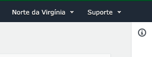
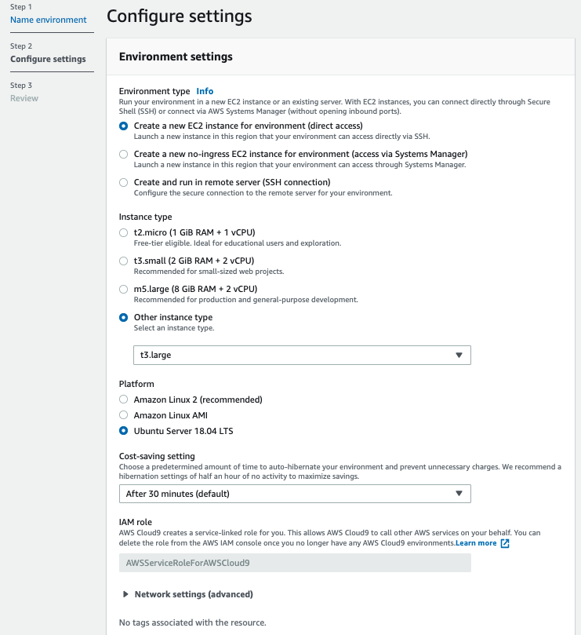
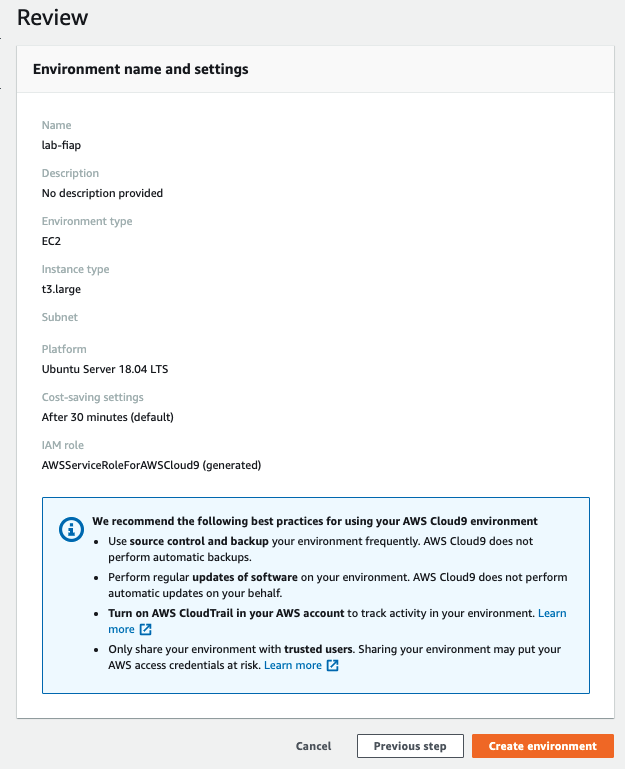
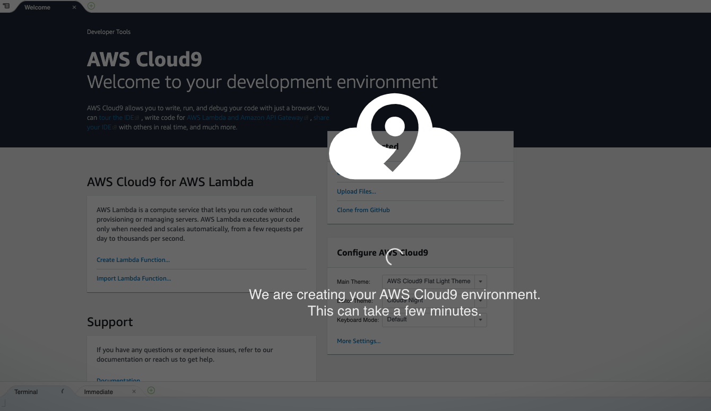
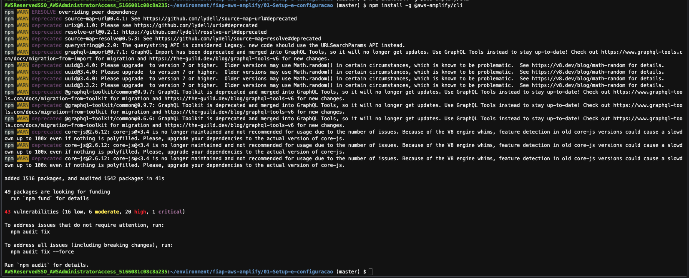

# 01 - Setup e Configuração de ambiente

 1. Abra o console da AWS e va para o serviço `Cloud 9`.
   
1. garanta que a região que esta utilizando é `us-east-1/ Norte da Virgínia`. Você consegue ver isso no canto superior direiro da tela.
    
 2. Clique em `create environment`.
 3. Coloque o nome `lab-fiap` e avance.
 
 5. Deixe as configurações como na imagem a seguir. Se atente ao tipo da maquina que deve ser t2.medium:

 6. Caso os parametros estejam como na imagem a seguir clique em `Create Environment`
   
 7. A criação do ambiente pode levar alguns minutos.

 8. Após a criação clique em `abrir IDE`, caso o IDE não tenha aberto automaticamente.
   
9. Para os próximos comandos utilize o console bash que fica no canto inferior do seu IDE.
   
10. Execute o comando `git clone https://github.com/vamperst/fiap-aws-amplify.git` para clonar o repositório com os exercicios.
11. Execute o comando `cd fiap-aws-amplify/` para entrar na pasta criada pelo git
12. Execute o comando `cd 01-Setup-e-configuracao` para entrar na pasta com os scripts de Configuração.
13. Precisamos aumentar o tamanho do volume(HD) do cloud9. Para isso execute o comando  `sh resize.sh`
   
16. Execute o comando `npm install -g @aws-amplify/cli` para instalar o serverless framework.
    
17. Execute o comando `npm install -g c9` para baixar a extenãp que ajudará o Cloud9 a lidar melhor com o como abrir arquivos no IDE.
