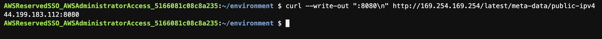

## Criar API GraphQL

1. Certifique-se de que esta na raiz do seu projeto executando o comando `cd ~/environment/postagram` no terminal.
2. Para criar o código que irá ser a API execute o comando `amplify add api` e escolha as opções como na imagem abaixo:
   
   1. Select from one of the below mentioned services: `GraphQL`
   2. Here is the GraphQL API that we will create. Select a setting to edit or continue: `continue`
   3. Choose a schema template: `Single object with fields (e.g., “Todo” with ID, name, description)`
   4. Choose your default editor: `None`
3. Antes de criar os recursos na sua conta é necessário criar o template do modelo de dados a ser utilizado. Para abrir o arquivo a ser editado execute o comando `c9 open ~/environment/postagram/amplify/backend/api/postagram/schema.graphql`
4. Altere o arquivo para que fique como na imagem abaixo e após salve o arquivo com CTRL+S.
   
5. Agora sim é hora de criar a API em sua Conta da AWS com o comando `amplify push -y`. A execução do comando pode demorar alguns minutos, mas é possivel acompanhar os logs da execução no terminal.
   
   
    
6. Hora de testar a API utilizando o console do serviço utilizado([AppSync](https://aws.amazon.com/pt/appsync/)). Para isso abra esse [link](https://console.aws.amazon.com/appsync/home?region=us-east-1#/apis) em uma nova aba do navegador e clique no nome da api que acabou de criar(postagram-dev).
   
   
7. Na lateral esquerda da tela clique em `Consultas`
   
8. Primeiro vamos criar um objeto no banco da dados via API, para fazer isso execute (aperte o botão laranja com uma seta) o comando abaixo na tela que acabou de acessar no console AWS:
   ``` 
   mutation createPost {
        createPost(input: {
        name: "My first post"
        location: "New York"
        description: "Best burgers in NYC - Jackson Hole"
    }) {
        id
        name
        location
        description
        }
    }   
   ```
    
9. Agora que tem um item no banco, execute uma query com o código abaixo que deve retornar um item como na imagem:
    ```
    query listPosts {
        listPosts {
            items {
            id
            name
            location
            description
            }
        }
    }
    ```
    
10. De volta ao cloud9 chegou a hora de adicionar a integração com a API na aplicação. Abra o arquivo principal a ser alterado com o comando `c9 open ~/environment/postagram/src/App.js`
11. Adicione o import da linha 15 do print
    
12. Altere a função App para que fique como na imagem abaixo e salve com CTRL+S.
    
13. Teste as alterações subindo o servidor com o comando `npm start`
    
14. Acesso o servidor com a ip publico + porta 8080. Caso precise pegar novamente uma opção ao que já foi ensinado é utilizar o comando `curl --write-out ":8080\n" http://169.254.169.254/latest/meta-data/public-ipv4` em um terminal diferente do que subiu o server no passo anterior. O ip [169.254.169.254](https://docs.aws.amazon.com/pt_br/AWSEC2/latest/UserGuide/instancedata-data-retrieval.html) é a maneira de recuperar metadados da EC2 por dentro da própria maquina.
    
15. Ao acessar a aplicação você verá que esta listando os itens do banco de dados.
    