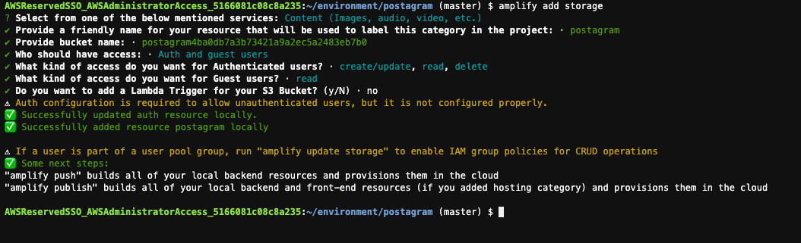
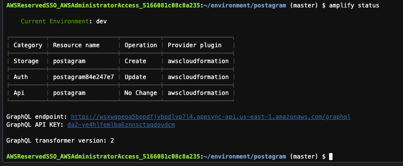
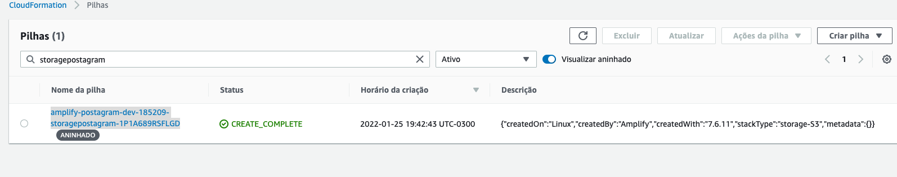
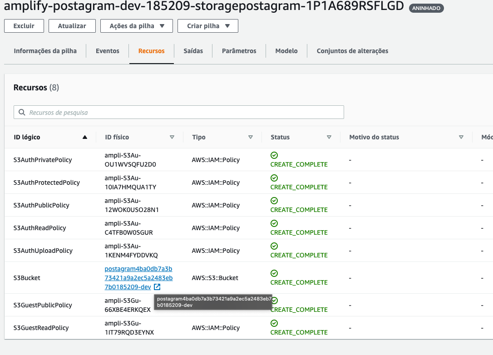

## Criando repositório de conteudo estático

1. O resultado final dessa demo é criar um app para postar fotos. Sendo assim é necessário que as fotos fiquem guardadas em um repositórios de objetos. Para adicionar um via amplify utilize o comando `amplify add storage` e adicione as opções como na imagem:
   
   1. Select from one of the below mentioned services: `Content (Images, audio, video, etc.)`
   2. Provide a friendly name for your resource that will be used to label this category in the project: : `postagram`
   3. Provide bucket name: `Mantenha o nome que aparece`
   4. What kind of access do you want for Authenticated users? : `create/update, read, delete` 
      1. Selectione as opções com a tecla espaço
   5. What kind of access do you want for Guest users? : `read`
      1. Selectione as opções com a tecla espaço
   6. Do you want to add a Lambda Trigger for your S3 Bucket? (y/N) · `no`
2. Confira que esta tudo certo utilizando o comando `amplify status` para verificar que existe um storage a ser criado e um update na autenticação. O update na autenticação acontece para que os usuarios do cognito possam utilizar o storage criado.
   
3. Agora para realizar as criações e alterações descobertas no passo anterior execute o comando `amplify push -y`
4. Para conferir o que foi criado via cloudformation utilize o [link](https://console.aws.amazon.com/cloudformation/home?region=us-east-1#/stacks?filteringStatus=active&filteringText=storagepostagram&viewNested=true&hideStacks=false&stackId=) e clique na unica opção que tem na tem disponivel.
   
5. Ao entrar na stack do cloudformation clique na aba `Recursos` para ver o que foi criado. Note que alem do bucket S3 onde os arquivos ficarão também foram criadas varias regras de segurança para garantir o uso correto dos arquivos de acordo com o modelo desejado.
   