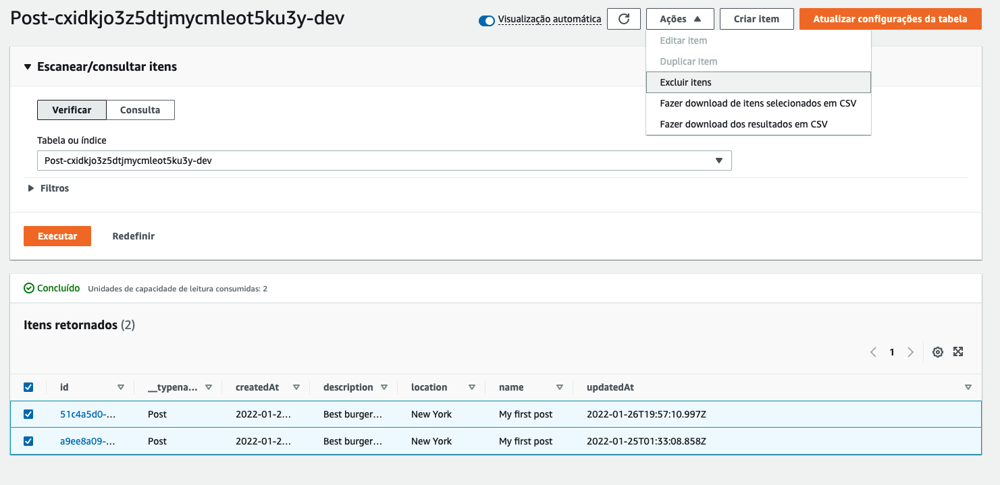

## Preparando código para aplicação de compartilhamento de fotos

1. Entre no diretório da aplicação com o comando `cd ~/environment/postagram`
2. A partir de agora você vai criar os arquivos que irão fazer parte da aplicação de compartilhamento de fotos dentro da pasta 'src/'. 
   1. Button.js
   2. CreatePost.js
   3. Header.js
   4. Post.js
   5. Posts.js
3. Para criar todos vazios utilize o comando abaixo:
   ``` shell
   touch src/Button.js src/CreatePost.js src/Header.js src/Post.js src/Posts.js
   ```
4. Nos próximos passos você terá que copiar o código completo do arquivo e colar no seu navegador. O primeiro é o Button.js que será o botão utilizado por todo o app. Abra com o comando `c9 open src/Button.js` e copie o seguinte conteúdo para ele e salve.
   ``` node
   import React from 'react';
   import { css } from '@emotion/css';

   export default function Button({
   title, onClick, type = "action"
   }) {
   return (
      <button className={buttonStyle(type)} onClick={onClick}>
         { title }
      </button>
   )
   }

   const buttonStyle = type => css`
   background-color: ${type === "action" ? "black" : "red"};
   height: 40px;
   width: 160px;
   font-weight: 600;
   font-size: 16px;
   color: white;
   outline: none;
   border: none;
   margin-top: 5px;
   cursor: pointer;
   \:hover {
      background-color: #363636;
   }
   `
   ```
5. Abra o arquivo 'Header.js' com o comando `c9 open src/Header.js`, copie o conteúdo abaixo e salve:
``` node
import React from 'react';
import { css } from '@emotion/css';
import { Link } from 'react-router-dom';

export default function Header() {
  return (
    <div className={headerContainer}>
      <h1 className={headerStyle}>Postagram</h1>
      <Link to="/" className={linkStyle}>All Posts</Link>
    </div>
  )
}

const headerContainer = css`
  padding-top: 20px;
`

const headerStyle = css`
  font-size: 40px;
  margin-top: 0px;
`

const linkStyle = css`
  color: black;
  font-weight: bold;
  text-decoration: none;
  margin-right: 10px;
  \:hover {
    color: #058aff;
  }
`

```

6. A próxima coisa que vamos fazer é criar o componente Posts para renderizar uma lista de postagens, isso irá na visão principal do aplicativo.Os únicos dados do post que serão renderizados nesta visão é o nome e a imagem do post.

   A matriz das postagens será passada como um suporte ao componente de posts.
   Para abrir o arquivo utilize o comando `c9 open src/Posts.js`, copie o conteudo abaixo e salve.
``` node
// Posts.js

import React from 'react'
import { css } from '@emotion/css';
import { Link } from 'react-router-dom';

export default function Posts({
  posts = []
}) {
  return (
    <>
      <h1>Posts</h1>
      {
        posts.map(post => (
          <Link to={`/post/${post.id}`} className={linkStyle} key={post.id}>
            <div key={post.id} className={postContainer}>
              <h1 className={postTitleStyle}>{post.name}</h1>
              
            </div>
          </Link>
        ))
      }
    </>
  )
}

const postTitleStyle = css`
  margin: 15px 0px;
  color: #0070f3;
`

const linkStyle = css`
  text-decoration: none;
`

const postContainer = css`
  border-radius: 10px;
  padding: 1px 20px;
  border: 1px solid #ddd;
  margin-bottom: 20px;
  \:hover {
    border-color: #0070f3;
  }
`

const imageStyle = css`
  width: 100%;
  max-width: 400px;
`

```
7. O próximo componente que criaremos é o CreatePost.Este componente é um formulário que será exibido para o usuário como uma sobreposição ou um modal.Nele, o usuário poderá alternar a sobreposição para mostrar e ocultá-lo, e também ser capaz de criar um novo post.

   Os adereços este componente receberão são os seguintes:
   1.UpdateOverLayVisibility - Esta função irá alternar a sobreposição para mostrar / ocultá-lo
   2. Updateposts - Esta função nos permitirá atualizar a matriz de mensagens principais
   3. Postagens - os posts voltando da nossa API
   Este componente tem muita coisa acontecendo, então antes de mergulharmos no código, vamos andar pelo que está acontecendo.

   4. Criamos algum estado inicial usando o gancho usestate.Este estado é criado usando o objeto Initialstate.
   5. O manipulador onchangetext define o nome, a descrição e os campos de localização do post
   6. O Handler OnChangeImage permite ao usuário fazer upload de uma imagem e economiza para o estado.Também cria um nome de imagem exclusivo.
   7. A função Salvar faz o seguinte:
      1. First checks to ensure that all of the form fields are populated
      2. Next it updates the saving state to true to show a saving indicator
      3. We then create a unique ID for the post using the uuid library
      4. Using the form state and the uuid, we create a post object that will be sent to the API
      5. Next, we upload the image to S3 using Storage.put, passing in the image name and the file
      6. Once the image upload is successful, we create the post in our GraphQL API
      7. Finally, we update the local state, close the popup, and update the local posts array with the new post
   
   Para abrir o arquivo utilize o comando `c9 open src/CreatePost.js`, copie o conteudo abaixo e salve.
``` node
// CreatePost.js

import React, { useState } from 'react';
import { css } from '@emotion/css';
import Button from './Button';
import { v4 as uuid } from 'uuid';
import { Storage, API, Auth } from 'aws-amplify';
import { createPost } from './graphql/mutations';

/* Initial state to hold form input, saving state */
const initialState = {
  name: '',
  description: '',
  image: {},
  file: '',
  location: '',
  saving: false
};

export default function CreatePost({
  updateOverlayVisibility, updatePosts, posts
}) {

  /* 1. Create local state with useState hook */
  const [formState, updateFormState] = useState(initialState)

  /* 2. onChangeText handler updates the form state when a user types into a form field */
  function onChangeText(e) {
    e.persist();
    updateFormState(currentState => ({ ...currentState, [e.target.name]: e.target.value }));
  }

  /* 3. onChangeFile handler will be fired when a user uploads a file  */
  function onChangeFile(e) {
    e.persist();
    if (! e.target.files[0]) return;
    const fileExtPosition = e.target.files[0].name.search(/.png|.jpg|.gif/i);
    const firstHalf = e.target.files[0].name.slice(0, fileExtPosition);
    const secondHalf = e.target.files[0].name.slice(fileExtPosition);
    const fileName = firstHalf + "_" + uuid() + secondHalf;
    console.log(fileName);
    const image = { fileInfo: e.target.files[0], name: fileName};
    updateFormState(currentState => ({ ...currentState, file: URL.createObjectURL(e.target.files[0]), image }))
  }

  /* 4. Save the post  */
  async function save() {
    try {
      const { name, description, location, image } = formState;
      if (!name || !description || !location || !image.name) return;
      updateFormState(currentState => ({ ...currentState, saving: true }));
      const postId = uuid();
      const postInfo = { name, description, location, image: formState.image.name, id: postId };

      await Storage.put(formState.image.name, formState.image.fileInfo);
      await API.graphql({
        query: createPost, variables: { input: postInfo }
      });
      updatePosts([...posts, { ...postInfo, image: formState.file }]);
      updateFormState(currentState => ({ ...currentState, saving: false }));
      updateOverlayVisibility(false);
    } catch (err) {
      console.log('error: ', err);
    }
  }

  return (
    <div className={containerStyle}>
      <input
        placeholder="Post name"
        name="name"
        className={inputStyle}
        onChange={onChangeText}
      />
      <input
        placeholder="Location"
        name="location"
        className={inputStyle}
        onChange={onChangeText}
      />
      <input
        placeholder="Description"
        name="description"
        className={inputStyle}
        onChange={onChangeText}
      />
      <input 
        type="file"
        onChange={onChangeFile}
      />
      { formState.file &&  }
      <Button title="Create New Post" onClick={save} />
      <Button type="cancel" title="Cancel" onClick={() => updateOverlayVisibility(false)} />
      { formState.saving && <p className={savingMessageStyle}>Saving post...</p> }
    </div>
  )
}

const inputStyle = css`
  margin-bottom: 10px;
  outline: none;
  padding: 7px;
  border: 1px solid #ddd;
  font-size: 16px;
  border-radius: 4px;
`

const imageStyle = css`
  height: 120px;
  margin: 10px 0px;
  object-fit: contain;
`

const containerStyle = css`
  display: flex;
  flex-direction: column;
  width: 400px;
  height: 420px;
  position: fixed;
  left: 0;
  border-radius: 4px;
  top: 0;
  margin-left: calc(50vw - 220px);
  margin-top: calc(50vh - 230px);
  background-color: white;
  border: 1px solid #ddd;
  box-shadow: rgba(0, 0, 0, 0.25) 0px 0.125rem 0.25rem;
  padding: 20px;
`

const savingMessageStyle = css`
  margin-bottom: 0px;
`

```

8. O próximo componente que construiremos é o componente Post.

   Neste componente, estaremos lendo o ID POST a partir dos parâmetros do roteador.Em seguida, usaremos este ID POST para fazer uma chamada de API para a API GraphQl para buscar os detalhes da postagem.

   Para abrir o arquivo utilize o comando `c9 open src/Post.js`, copie o conteudo abaixo e salve.

``` node
// Post.js

import React, { useState, useEffect } from 'react'
import { css } from '@emotion/css';
import { useParams } from 'react-router-dom';
import { API, Storage } from 'aws-amplify';
import { getPost } from './graphql/queries';

export default function Post() {
  const [loading, updateLoading] = useState(true);
  const [post, updatePost] = useState(null);
  const { id } = useParams()
  useEffect(() => {
    fetchPost()
  }, [])
  async function fetchPost() {
    try {
      const postData = await API.graphql({
        query: getPost, variables: { id }
      });
      const currentPost = postData.data.getPost
      const image = await Storage.get(currentPost.image);

      currentPost.image = image;
      updatePost(currentPost);
      updateLoading(false);
    } catch (err) {
      console.log('error: ', err)
    }
  }
  if (loading) return <h3>Loading...</h3>
  console.log('post: ', post)
  return (
    <>
      <h1 className={titleStyle}>{post.name}</h1>
      <h3 className={locationStyle}>{post.location}</h3>
      <p>{post.description}</p>
      
    </>
  )
}

const titleStyle = css`
  margin-bottom: 7px;
`

const locationStyle = css`
  color: #0070f3;
  margin: 0;
`

const imageStyle = css`
  max-width: 500px;
  @media (max-width: 500px) {
    width: 100%;
  }
`

```

9. Em seguida, precisamos criar o roteador no app.js. Nosso aplicativo terá duas rotas principais:

   1. Uma rota em casa - /.Esta rota tornará uma lista de posts da nossa API
   2. Um post Details Route - /post/:ID. Esta rota tornará um único post e detalhes sobre esse post.
   Usando reagir roteador, podemos ler o ID POST da rota e, em seguida, buscar o post associado a ele.Este é um padrão comum em muitos aplicativos, pois faz o link compartilhável.

   Outra maneira de fazer isso seria ter alguma configuração de gerenciamento do estado global e, em seguida, definir o ID do Pós-ID no estado global.A principal desvantagem dessa abordagem é que o URL não pode ser compartilhado.

   Além de roteamento, a principal funcionalidade acontecendo neste componente é uma chamada para buscar posts da nossa API GraphQL.

   Para abrir o arquivo utilize o comando `c9 open src/App.js`, copie o conteudo abaixo e salve.
``` node
// App.js

// Importa o que é necessário para Configurar o amplify para ter acesso aos recursos aws criados no projeto
import Amplify from 'aws-amplify'
import config from './aws-exports'

import React, { useState, useEffect } from "react";
import {
  HashRouter,
  Switch,
  Route
} from "react-router-dom";
import { withAuthenticator } from '@aws-amplify/ui-react';
import { css } from '@emotion/css';
import { API, Storage, Auth } from 'aws-amplify';
import '@aws-amplify/ui-react/styles.css';
import { listPosts } from './graphql/queries';

import Posts from './Posts';
import Post from './Post';
import Header from './Header';
import CreatePost from './CreatePost';
import Button from './Button';

// Configura o amplify para ter acesso aos recursos aws criados no projeto
Amplify.configure(config)

function Router({user, signOut}) {

  /* create a couple of pieces of initial state */
  const [showOverlay, updateOverlayVisibility] = useState(false);
  const [posts, updatePosts] = useState([]);

  /* fetch posts when component loads */
  useEffect(() => {
      fetchPosts();
  }, []);

  async function fetchPosts() {

    /* query the API, ask for 100 items */
    let postData = await API.graphql({ query: listPosts, variables: { limit: 100 }});
    let postsArray = postData.data.listPosts.items;

    /* map over the image keys in the posts array, get signed image URLs for each image */
    postsArray = await Promise.all(postsArray.map(async post => {
      const imageKey = await Storage.get(post.image);
      post.image = imageKey;
      return post;
    }));

    /* update the posts array in the local state */
    setPostState(postsArray);
  }
  
  async function setPostState(postsArray) {
    updatePosts(postsArray);
  }

  return (
    <>
      <HashRouter>
          <div className={contentStyle}>
            <Header />
            <hr className={dividerStyle} />
            <Button title="New Post" onClick={() => updateOverlayVisibility(true)} />
            <Switch>
              <Route exact path="/" >
                <Posts posts={posts} />
              </Route>
              <Route path="/post/:id" >
                <Post />
              </Route>
            </Switch>
          </div>
          <button onClick={signOut}>Sign out</button>
        </HashRouter>
        { showOverlay && (
          <CreatePost
            updateOverlayVisibility={updateOverlayVisibility}
            updatePosts={setPostState}
            posts={posts}
          />
        )}
    </>
  );
}

const dividerStyle = css`
  margin-top: 15px;
`

const contentStyle = css`
  min-height: calc(100vh - 45px);
  padding: 0px 40px;
`

export default withAuthenticator(Router);

```

10. Antes de testar o código você precisa limpar a tabela do dynamoDB. Para isso siga os passos abaixo:
    1.  Execute o comando `amplify console` e selecione `AWS console` para ter acesso ao link do console do amplify.
      
    2.  Abra o link do terminal em uma aba do navegador
    3.  No painel do seu projeto do amplify clique na aba `API`
    4.  Em data sources clique no botão `View` da tabela `PostTable`
    
    5. No canto direito superior do painel do DynamoDB clique em `Explorar itens da tabela`
    
    6. Selecione todos os items da tabela, clique em ações no canto superior direito e então `Excluir Itens`. Confirme a operação. Repita se necessário até que não tenha items na tabela.
    
    

11. De volta ao cloud9, execute o comando `npm start` para subir o servidor e acesse em outra aba do navegador utilizando o ip da maquina + porta 8080
12. Adicione posts para testar a funcionalidade.