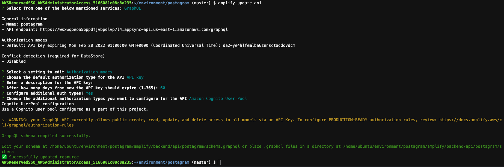
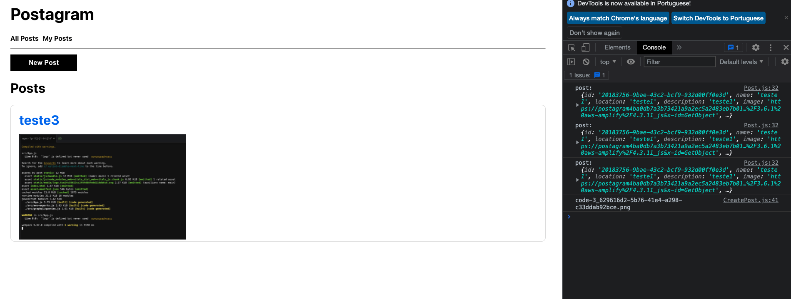

## Adicionando permissões no modelo da API

1. Você pode atualizar a API do AppSync para ativar vários modos de autorização.

    Neste exemplo, atualizaremos a API para usar a tecla Cognito e API para permitir uma combinação de acesso público e privado.Isso também nos permitirá implementar a autorização para a API.

    Utilize o comando `amplify update api` e selecione as seguintes opções:
    1. Select from one of the below mentioned services: `GraphQL`
    2. Select a setting to edit (Use arrow keys): `Authorization modes`
    3. Choose the default authorization type for the API (Use arrow keys): `API key`
    4. Configure additional auth types?: `Y`
    5. Choose the additional authorization types you want to configure for the API (Press <space> to select): `Amazon Cognito User Pool`
    
2. Hora de alterar o schema do modelo de entidate utilizado no banco de dados. Para isso abra o arquivo com o comando `c9 open amplify/backend/api/postagram/schema.graphql` e substitua o conteúdo pelo seguinte:
``` graphql
type Post @model
  @auth(rules: [
    { allow: owner },
    { allow: public, operations: [read] },
    { allow: private, operations: [read] }
  ]) {
  id: ID!
  name: String!
  location: String!
  description: String!
  image: String
  owner: String
}

```
3. Execute as mudanças com o comando `amplify push -y` e aguarde o final do processo com sucesso.
4. Para que a alteração faça efeito na aplicação serão necessárias algumas modificações. A primeira delas é no arquivo <b>CreatePost.js</b>. Para abrir ele utilize o comando `c9 open src/CreatePost.js` e altere apenas o método <b>save</b> conforme o código abaixo:
```node
async function save() {
    try {
      const { name, description, location, image } = formState;
      if (!name || !description || !location || !image.name) return;
      updateFormState(currentState => ({ ...currentState, saving: true }));
      const postId = uuid();
      const postInfo = { name, description, location, image: formState.image.name, id: postId };
  
      await Storage.put(formState.image.name, formState.image.fileInfo);
      await API.graphql({
        query: createPost,
        variables: { input: postInfo },
        authMode: 'AMAZON_COGNITO_USER_POOLS'
      }); // updated
      const { username } = await Auth.currentAuthenticatedUser(); // new
      updatePosts([...posts, { ...postInfo, image: formState.file, owner: username }]); // updated
      updateFormState(currentState => ({ ...currentState, saving: false }));
      updateOverlayVisibility(false);
    } catch (err) {
      console.log('error: ', err);
    }
  }
```
5. No arquivo <b>App.js</b> serão 3 alterações. Para abrir o arquivo utilize o comando `c9 open src/App.js`
   1. No inicio da função Router crie um novo estado para manter seus próprios posts chamados MyPosts:
   ``` node
   const [myPosts, updateMyPosts] = useState([]);
   ```
   2. Em seguida, no método `setPostState`, atualize `MyPosts` com posts do usuário assinado:
    ``` node
    async function setPostState(postsArray) {
      const user = await Auth.currentAuthenticatedUser();
      const myPostData = postsArray.filter(p => p.owner === user.username);
      updateMyPosts(myPostData);
      updatePosts(postsArray);
    }
    ```
   3. Adione uma nova rota:
    ``` node
    <Route exact path="/myposts" >
      <Posts posts={myPosts} />
    </Route>
    ```
6. O arquivo <b>Header.js</b> precisa apenas de uma modificação. Abra ele com o comando `c9 open src/Header.js` e adicione o link para a nova página MyPosts:
   ``` node
   <Link to="/myposts" className={linkStyle}>My Posts</Link>
   ```
7. Suba servidor com `npm start` e teste as alterações. Se criar mais um usuário e adicionar posts em ambos será mais facil de ver a atualização:
   