## Hospedando o site no S3 e adicionando 

1. Nesse passo você vai criar a hospedagem do seu site no S3 e criar uma entrega continua para cada push no github. A primeira coisa a se fazer é criar/fazer login em sua conta do [github](https://github.com/).
2. Crie um novo projeto publico no seu github com o nome `postagram`: [link para criar](https://github.com/new)
3. Ao final do passo 2 você deve ter uma tela como essa abaixo no github. Deixe essa aba aberta pois vamos precisar dessas informações adiante
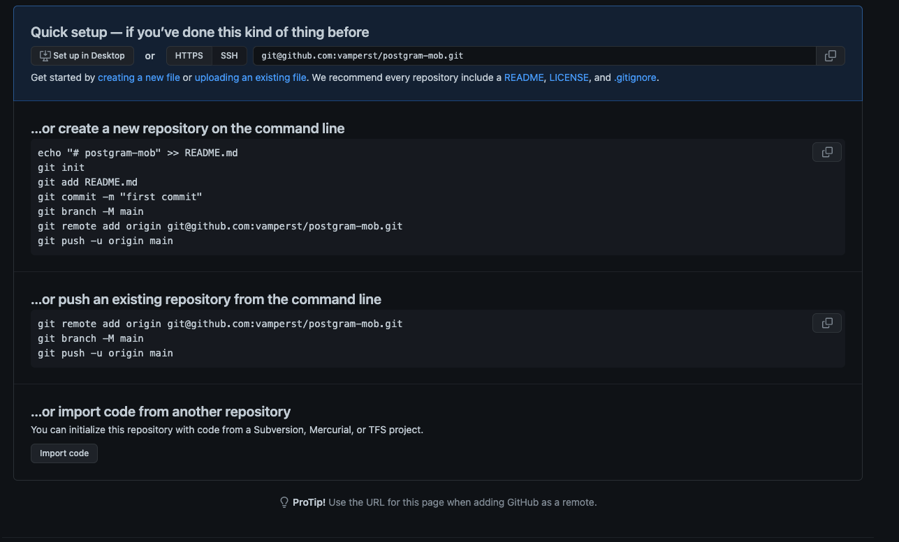
4. Você irá precisar de uma chave ssh para acessar sua conta do github por dentro do cloud9. Para isso siga 2 tutoriais do github.
   1. Como criar sua chave ssh no linux: [tutorial](https://docs.github.com/en/authentication/connecting-to-github-with-ssh/generating-a-new-ssh-key-and-adding-it-to-the-ssh-agent)
   2. Como adicionar sua chave no github: [tutorial](https://docs.github.com/en/authentication/connecting-to-github-with-ssh/adding-a-new-ssh-key-to-your-github-account)
5. Com a chave criada, tenha certeza que esta na pasta do projeto com o comando `cd ~/environment/postagram/`
6. Adicione o código no seu repositório do github utilizando os comandos abaixo. Certifique de que o colocou seu usuario no comando de git add:
   ``` shell
   git init
   git add -A
   git commit -m "first commit"
   git remote add origin git@github.com:SEU-USUARIO/postgram.git
   git push origin master
   ```
7. Inicie a criação do hosting no S3 com o comando `amplify hosting add`
   1. Em 'Select the plugin module to execute ' selecione `Hosting with Amplify Console (Managed hosting with custom domains, Continuous deployment)`
   2. Em 'Choose a type' selecione `Continuous deployment (Git-based deployments)`
   3. Nesse passo deixe o terminal como esta e vá para outra aba no painel do amplify e entre no seu projeto `postagram` e selecione a aba `Hosting Environments`
   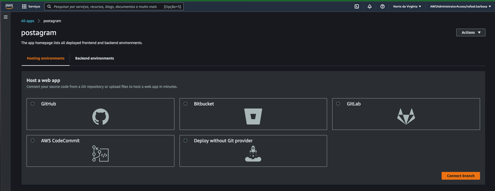
   4. Selecione o GitHub e clique em `Connect branch` na lateral inferior direita.
   5. Autorize o amplify a acessar seu github, selecione o projeto `postagram` e a branch `master`. Clique em next.
   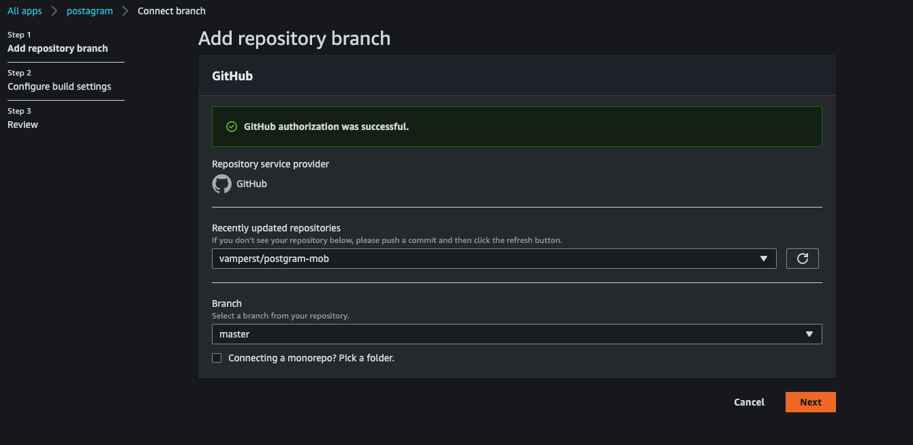
   6. Escolha o `environment` `dev`
   7. Habilite a opção `Enable full-stack continuous deployments (CI/CD)`
   8. Clique em `Create new role`, isso vai abrir uma nova aba onde apenas tem que clicar em next até criar a role necessária. Após o processo volte ao amplify e selecione a role criada. Caso ela não apareça na lista, clique em `Refresh existing roles`. Clique em Next
   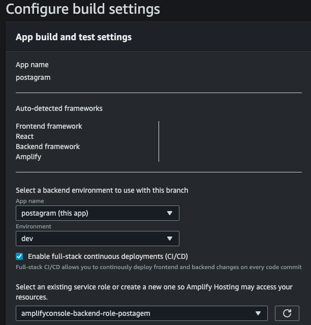
   9. Revise as informações e clique em `Save and Deploy`. Isso vai criar um primeiro deploy. Pode ignorar ele por hora.
   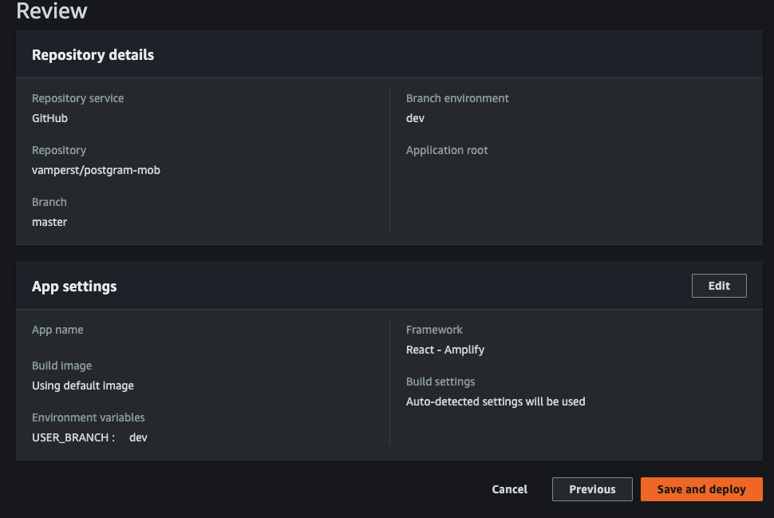
8. Volte ao Cloud9 e pressione enter no terminal que estava aguardando.
   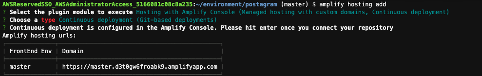
9. Execute os seguintes comandos para atualizar o github e executar o pipeline do projeto para adicionar o host do S3 diretamente via pipeline.
  ```
  git status
  git add -A
  git status
  git commit -m "adding hosting"
  git push origin master
  ```
  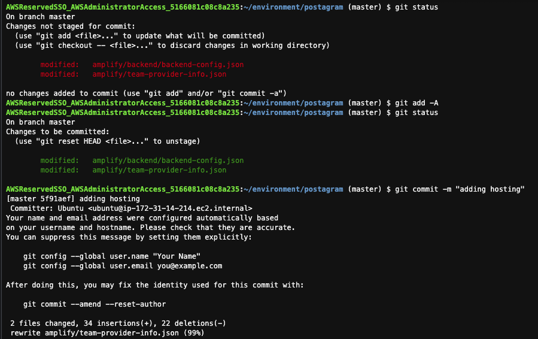
  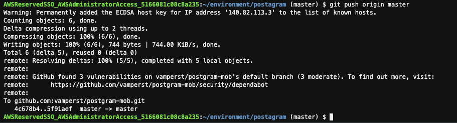
10. Devolta ao console do amplify poderá ver que um pipeline iniciou a partir do push para o github que acabou de fazer. Caso ainda esteja rodando o pipeline de quando criou a configuração, apenas aguarde.
    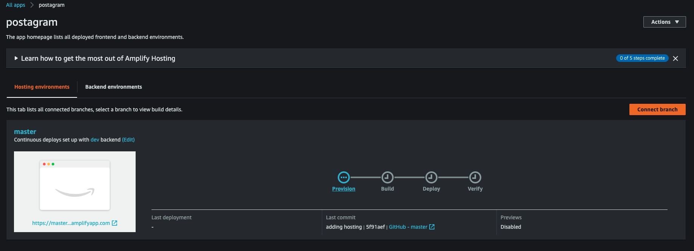
11. Você pode acompanhar cada fase clicando nela. E expandindo o log.
    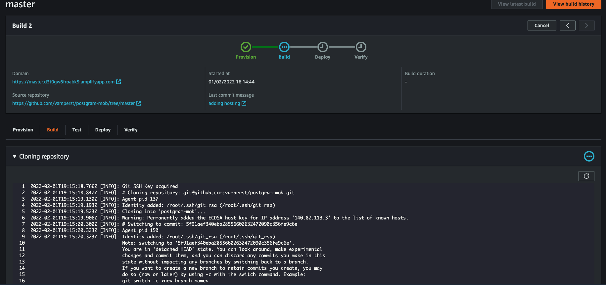
12. Durante o processo de build do frontend o pipeline vai rodar o `npm build` e fazer o upload dos artefatoas para o S3. 
13. Ao final será possivel pegar o link do seu app no campo domain. Esta selecionado no print abaixo.
    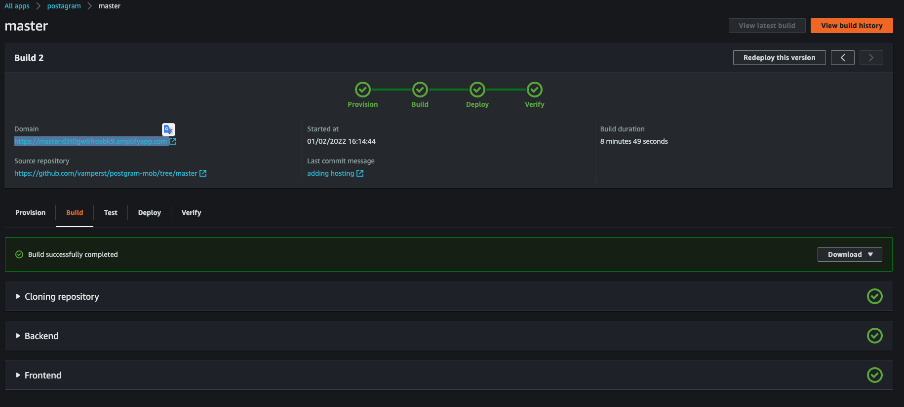
14. Acesse sua aplicação via o link e utilize normalmente.